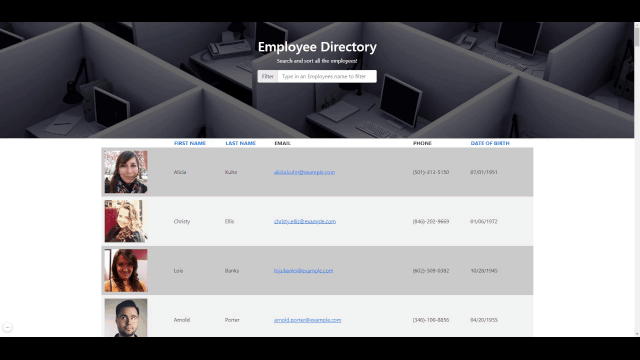

# Employee-Directory

## Description

An application that allows a user to search and sort a list of employees.

An employee or manager would benefit greatly from being able to view non-sensitive data about other employees. It would be particularly helpful to be able to filter employees by name.

## Table of Contents

- [Technolgies](#Technologies-Utilized)
- [Usage](#usage)
- [Credits](#credits)
- [License](#license)

## Technologies-Utilized

- [React.js](https://reactjs.org/)
- [JavaScript](https://developer.mozilla.org/en-US/docs/Web/JavaScript)
- [Node.js](https://nodejs.org/en/)
- [Bootstrap](https://getbootstrap.com/)
- [CSS](https://developer.mozilla.org/en-US/docs/Web/CSS)
- [Random User API](https://randomuser.me/)

## Usage

- A user can perform the following

  - Filter the list of employees by first or last name by entering name into text field. Employee list will automatically filter as user enters txt
  - Sort employees by the following: - First Name ascending - First Name descending - Last Name ascending - Last Name descending - Date of Birth ascending - Date of Birth descending

## Deployed Application Link

- [Deployed Link](https://bahuisken.github.io/Employee-Directory/)

- Screenshots of the application:

## Credits

- [bahuisken](https://github.com/bahuisken/)
- Lessons from University of Denver Fullstack Coding Bootcamp

## License

None

## Contributing

[Contributor Covenant](https://www.contributor-covenant.org/)

## Tests

N/A

## Questions

If you have any questions about the repo, open an issue or contact me directly at [brice.huisken@gmail.com](mailto:brice.huisken@gmail.com). You can find more of my work at [bahuisken](https://github.com/bahuisken/)
